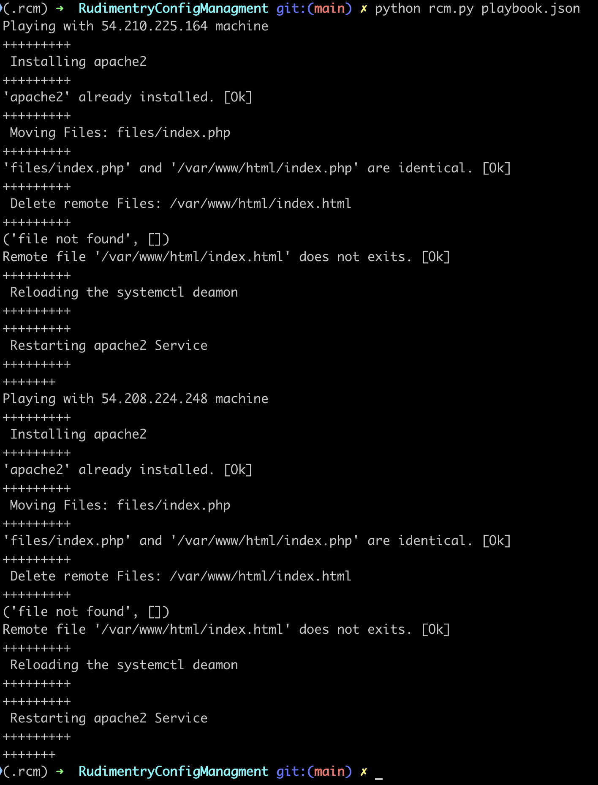
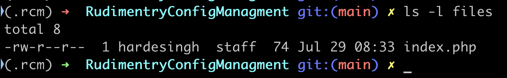

# RudimentryConfigManagment
  A client less Rudimentry config managment tool which uses SSH and python to configure remote targer machies.<br>

**System Requirements**:<br>
  Python 3<br>
  Python Modules: paramiko

**Components of the rCM**:
  Name | Purpose | Modify
  ------------ | ------------- | -------------
  rcm.py | Automation Script | No
  playbook.json | User defined set of tasks | Yes
  files | Files needed for user tasks <directory> | yes

**Usage**:<br/>
  
  ```python rcm.py playbook.json```<br/>
  
  
  
**Playbook tasks/Modules**<br/>
  Playbook is any jason file which is written in a defined way:
  - It is a list of dictionaries, each dictionary (config block) is set of configuratio n that belong to a single set of machines (with same authentication).
  - Each config block should contain a key `access_details`.
  - Each config block should contain a key `config`, which contains all module definations required for that specific server block.<br>
  
_Details about modules of playbook_<br/>
  - access_details<br>
  
  parameter |	required |	choices |	comments
  ------------ | ------------- | ------------- | -------------
  ip | yes |  | comma seprated list of host ips
  user | yes | | remote user name
  password | yes | | ssh password for remote machines
  keypair | yes | | ssh key for passwordless connections<br> either password or keypair is required
  
  - config<br>
    - packages: Module for remote package managment<br>
      parameter |	required |	choices |	comments
      ------------ | ------------- | ------------- | -------------
      name | yes | | list of debian package names
      state | yes | *present<br> *absent | Whether to install or remove a package
  
    - files: Module for remote file managment<br>
      parameter |	required |	choices |	comments
      ------------ | ------------- | ------------- | -------------
      name | yes | | name of the file
      state | yes | *copy<br> *absent | Whether to copy or remove a remote file
      source | yes | | local file path
      destination | yes | | remote file path
      mode | no | | * file mode for remote file<br>* required for copy state
    - services: Module for remote file managment<br>
      parameter |	required |	choices |	comments
      ------------ | ------------- | ------------- | -------------
      name | yes | | list of systemd services<br>(not required for daemon-reload state)
      state | yes | *start<br>*stop<br>*restart<br>*daemon-reload | state of the service
      
  
  
  
**Files**<br/>
  This directory contains all the files that needs to be copied/transfered to the target machines.<br>
  
  
**Notes**<br/>
  This tool currently only supports Ubuntu/Debian target machines with a limited set of modules/features.


